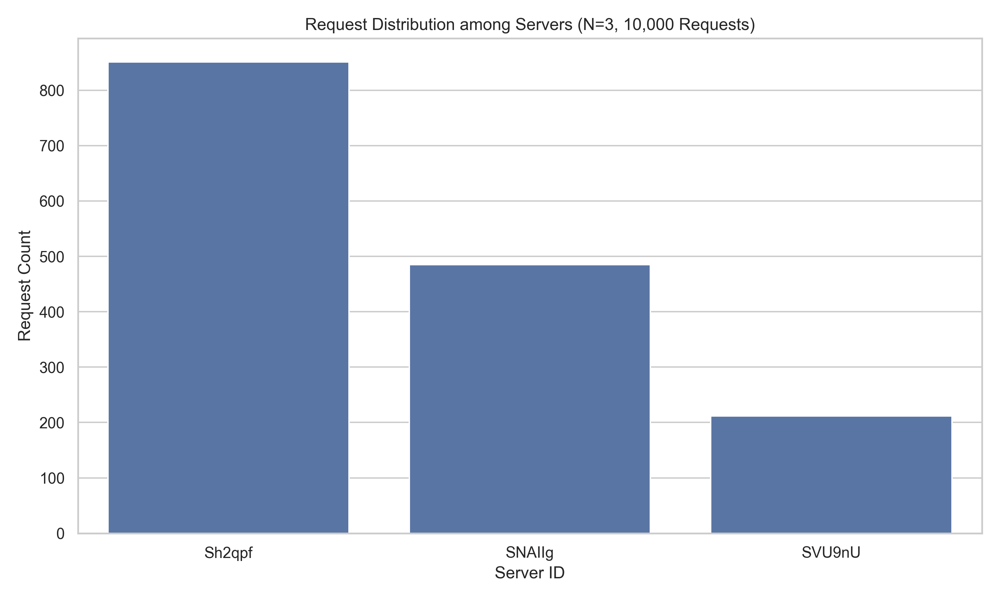
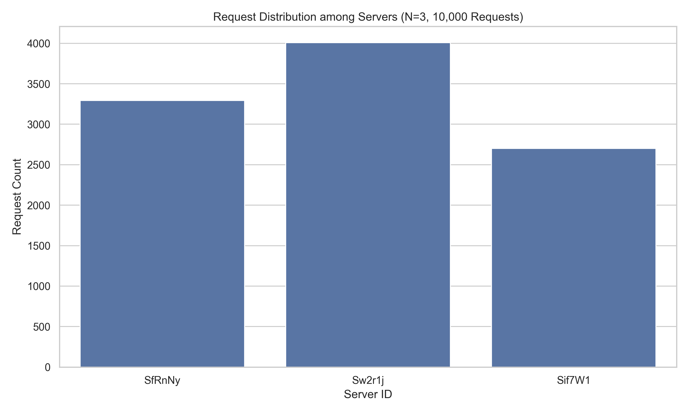

# Distributed Load Balancer using Consistent Hashing

This project is a Dockerized Python-based load balancer that distributes client requests to backend server containers using consistent hashing. It supports dynamic scaling, automatic failure recovery, and performance analysis.

> ICS 4104 – Distributed Systems  
> Strathmore University  
> Authors: Jasmeet Singh, Karenzi David, Joseph Mwaura, Ng'ang'a Nathan 
> Year: 2025

---

## 🔧 Technologies Used

- Python 3.9+
- FastApi (Web framework)
- Docker & Docker Compose
- Matplotlib (Visualization)
- Threading (for heartbeat monitoring)
- Linux (Ubuntu)

---

## 📁 Project Structure
```
├── analysis
│   ├── request_distribution/
│   ├── request_distribution2/
│   ├── scalability/
│   ├── scalability2/
│   ├── request_distribution.py
│   ├── requirements.txt
│   └── scalability_analysis.py
├── app
│   ├── Dockerfile
│   ├── main.py
│   └── requirements.txt
├── lb
│   ├── Dockerfile
│   ├── hashing.py
│   ├── main.py
│   ├── requirements.txt
│   ├── servers.py
│   └── utils.py
└── docker-compose.yaml

```
## 🚀 How to Run the Project
### 1. Start Docker

```bash
sudo systemctl start docker
```
### 2. Clone the Repository
```bash
git clone https://github.com/JasmeetMudher/distributed-load-balancer.git
cd distributed-load-balancer
```
### 3. Build and Launch All Containers
```bash
docker compose up --build
```
## 🌐 API Endpoints (via Load Balancer at `localhost:5000`)

| Endpoint     | Method | Description                                      |
|--------------|--------|--------------------------------------------------|
| `/home`      | GET    | Routes request using consistent hashing         |
| `/rep`       | GET    | Returns list of active backend replicas         |
| `/add`       | POST   | Adds new server replicas dynamically            |
| `/rm`        | DELETE | Removes server replicas                         |
| `/heartbeat` | GET    | Used internally for server health monitoring    |

---

## ✅ Features

- Consistent hashing with 512 slots and 9 virtual replicas per server
- Dynamic server addition/removal (`/add`, `/rm`)
- Failure detection using heartbeat monitoring
- Replacement of dead containers with new ones
- Graph-based analysis with real-time load metrics
- Easily extendable for advanced use cases

## 📊 Performance Analysis

---

### A-1: Load Distribution (10,000 Requests)

**Script:** `request_distribution.py`

- Sends 10,000 requests to `/home`
- Tallies how many each backend server handled
- Generates a bar chart: `/analysis/request_distribution/*.png`

**Result:**  
Load is not consistetly balanced across all servers using consistent hashing.



---

### A-2: Scaling from N = 2 to 6 Servers

**Script:** `scalability_analysis.py`

- Repeats 10,000 requests for each value of N from 2 to 6
- Plots average requests per server against N
- Generates a line chart: `/analysis/scalability/*.png`

**Result:**  
Average load per server is random across multiple tests.


---

### A-3: Server Failure & Auto-Recovery

**Simulate failure:**

```bash
docker stop server_2 && docker rm server_2
```
- Load balancer detects failure via /heartbeat in a background thread
- Automatically removes the failed replica and spawns a new one

### A-4: Modified Hash Function

**File:** `consistent_hash_alt.py`

```python
def virtual_hash_updated(server_id: str, v_index: int) -> int:
    key = f"{server_id}-{v_index}"
    return hash_string_to_int(key, mod=NUM_SLOTS)

def request_hash_updated(i: string) -> int:
    return hash_string_to_int(i, mod=NUM_SLOTS)
```

- After testing, results (bar and line charts) are below
Load is balanced across all servers using consistent hashing.


Average load per server decreases proportionally as N increases.
